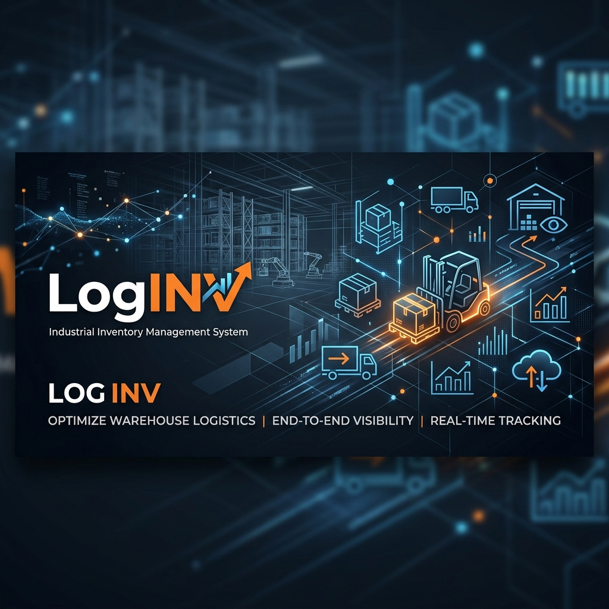

# 🌾 LogINV – Advanced Agro-Industrial Inventory System

<p align="center">
  
</p>

<p align="center">
  <strong>Advanced inventory and logistics platform for agro-industrial plants, feed manufacturers, and food service establishments.</strong><br/>
  Real-time stock control • Daily Counts • Multi-location • Expiration Alerts • ROP (Reorder Point) engine • Multilingual Support
</p>

<p align="center">
  
  
  
  
</p>

---

## 🇪🇸 Descripción (Español)

**LogINV** es una solución integral para la gestión de inventarios diseñada para entornos de alta exigencia, desde molinos agroindustriales hasta establecimientos de servicio. El sistema ofrece un control granular y versátil mediante una interfaz optimizada para dispositivos móviles (PWA) y herramientas avanzadas de trazabilidad.

### ✨ Características Principales
- **Dashboard Inteligente:** KPIs en tiempo real, alertas de stock crítico (ROP) y semáforo de vencimientos dinámico.
- **Conteo de Inventario:** Sistema de conteo *tap-to-count* a pantalla completa con soporte para escaneo de códigos de barras.
- **Multi-ubicación:** Gestión centralizada de múltiples almacenes o puntos de venta (Bar 1, Bar 2, Almacén, etc.).
- **Motor ROP (Punto de Reorden):** Sugerencias automáticas de abastecimiento basadas en niveles críticos.
- **Reportes Avanzados:** Exportación a CSV y generación de reportes PDF profesionales para auditorías de conteo.
- **Multilingüe:** Soporte nativo para Español, Inglés, Chino y Japonés.

---

## 🇺🇸 Description (English)

**LogINV** is a comprehensive inventory management solution designed for high-demand environments, from agro-industrial mills to food service establishments. The system provides granular and versatile control through a mobile-optimized interface (PWA) and advanced traceability tools.

### ✨ Key Features
- **Smart Dashboard:** Real-time KPIs, critical stock alerts (ROP), and dynamic expiration "traffic light" system.
- **Inventory Counting:** Full-screen *tap-to-count* system with integrated barcode scanning support.
- **Multi-location:** Centralized management of multiple warehouses or points of sale (Bar 1, Bar 2, Warehouse, etc.).
- **ROP Engine (Reorder Point):** Automatic supply suggestions based on critical stock levels.
- **Advanced Reporting:** CSV export and professional PDF report generation for inventory audits.
- **Multilingual:** Native support for Spanish, English, Chinese, and Japanese.

---

## 🛠️ Tech Stack | Tecnologías

| Technology | Usage |
| :--- | :--- |
| **Next.js 14** | Core Framework (App Router & SSR) |
| **Firebase / Firestore** | Real-time Database & Persistence |
| **Tailwind CSS** | Premium Responsive UI Design |
| **Lucide React** | Modern Iconography |
| **html5-qrcode** | Camera-based Barcode Scanning |
| **Context API** | State Management (Auth, Locations, Theme) |

---

## 🚀 Getting Started | Inicio Rápido

### 1. Installation | Instalación
```bash
git clone https://github.com/sjaquer/LogINV.git
cd LogINV
npm install
```

### 2. Environment Setup | Configuración del Entorno
Create a `.env.local` file based on `.env.example`:
```bash
cp .env.example .env.local
```
Fill in your Firebase credentials and demo passwords.

### 3. Database Seeding | Poblar Base de Datos
To populate your Firestore with industrial and retail sample data:
```bash
npm run seed
```

### 4. Run Development | Ejecutar Desarrollo
```bash
npm run dev
```

---

## 🔐 Role System | Sistema de Roles

| Role | Default Pass | Permissions |
| :--- | :--- | :--- |
| **LOGISTICA** | `1234` | Stock updates, daily counts, product creation. |
| **PLANTA** | `5678` | View-only + stock updates. |
| **ADMIN** | `admin` | Full access + Admin level approvals. |
| **GERENCIA** | `master` | Full access + Executive level validation. |

---

## 📱 Responsive Design | Diseño Adaptable

LogINV is built with a **Mobile-First** approach:
- **PWA Ready:** Manifest and optimization for installation on iOS and Android.
- **Tap-to-count:** Large touch targets optimized for fast physical inventory.
- **Safe Areas:** Support for modern smartphone notches and home indicators.

---

## 📄 License | Licencia

This project is licensed under the **MIT License**. See the [LICENSE](./LICENSE) file for details.

---

<p align="center">
  Developed for High-Efficiency Logistics 🌾<br/>
  <strong>LogINV – Smart Inventory Control</strong>
</p>
